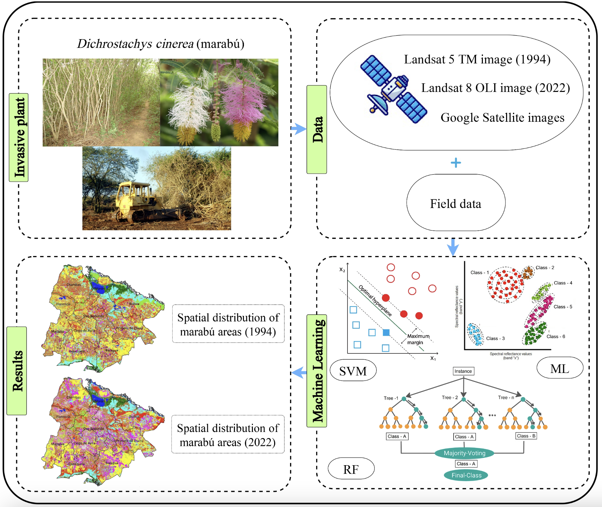

# Introduction to Remote Sensing {.unnumbered}

## What is remote sensing?

Put simply, remote sensing is a method of acquiring information from a distance through sensors mounted on a platform (e.g., satellites, planes, drones).

### Active vs passive sensors

**Passive sensors** do not emit energy themselves and rely on naturally available energy, primarily solar electromagnetic radiation (EMR) reflected off the earth's surface. Consequently, they are ineffective in low-light conditions and are unable to penetrate atmospheric obstacles (clouds, smoke, dense vegetation).

**Active sensors** emit their own EMR and wait to receive the reflected energy. The emitted energy is able to 'pass through' atmospheric obstacles (depending on the wavelength of the emitted energy) which have smaller particle sizes instead than being scattered, absorbed or reflected.

### Spectral Signatures

Spectral signatures show how different materials reflect or absorb electromagnetic energy across a spectrum of wavelengths on the electromagnetic spectrum (EMS). Each feature on Earth has a unique spectral signature that is determined its by physical and chemical properties.

)](images/spectral_sig.png)

An important feature in the spectral signature of vegetation is the **red edge** - a sharp increase in reflectance around 700 nm which indicates chlorophyll content and plant health.

### Resolutions

The characteristics of remote sensors will determine the level of accuracy and detail of the information about the Earth's surface.

#### Spectral Resolution

Spectral resolution refers to a sensor’s ability to distinguish between different wavelengths of electromagnetic radiation from the received signal. Each spectral band corresponds to a specific wavelength range, and averages its information across this range. Higher spectral resolutions are achieved with wider and more spectral bands.

Sometimes there are large gaps of wavelength ranges in the EMS in which no information is collected, and this is because the atmosphere does not allow certain wavelengths to pass. Thus, bands are often limited to atmospheric windows where wavelengths can penetrate.

)](images/spectral_resolution.png)

It's pretty crazy to think how much satellite technology has improved in such a short space of time. Landsat 1, launched in 1972, had just 4 spectral channels, all of which were in the near IR and visible EMS range. Landsat 8, launched in 2013 has an impressive 11 channels, expanding the EMS range to allow for land surface temperature data and improved moisture detection.

#### What happens next?

Looking more closely at the Landsat 1 (MSS) satellite...

The information captured by each of the four spectral bands are stored as a greyscale images representing reflectance, which, combined with spectral signatures can give us information about the Earth's surface.

)](images/clipboard-3618918105.png)

#### Other Resolutions

**Spatial**: The size of the raster grid per pixel, from 10cm to several kilometers.

**Temporal**: The time between revisits of information collection for a given location.

**Radiometric**: The ability of a sensor to identify and show small differences in energy.

## Applications

### Making sense of black and white images

Colour composites are images created by assigning of the spectral bands to the red, green and blue (RGB) display channels. The choice of spectral bands can be used to highlight specific features that are often not visible to the human eye.

[)](https://ltb.itc.utwente.nl/uploads/studyarea/498/Pics_2015_jpg/Fig5_6.jpg)](https://www.researchgate.net/publication/233793398_Principles_of_remote_sensing_an_introductory_textbook)

True colour composites (TCC) display the Earth as we would see it with our eyes. False colour composites (FCC) use non-visible bands in the near-infrared range alongside red and green to make vegetation bright red. The choice of these three bands has to do with plants reflecting near-infrared and green light while absorbing red light (remember **spectral signatures**).

There is often debate about which colour composite is best for identifying certain features. @haack1995 addressed this by testing the accuracy of agricultural crop identification using different colour composites. Identification accuracy results varyied from 62% for standard FCC to 84% for a colour composite determined through transformed divergence (a statistical test to decide which colour composite was best given the context). The study demonstrated the efficacy of using Short-Wave Infrared (SWIR) bands for crop identification, and highlighted the inaccuracy of the standard FCC (which relied solely on visible and near-IR bands).

### Invasive species mapping

The value of SWIR bands for vegetation and crop identification is now widely recognized in the remote sensing community. A bit more up my area of expertise (coming from background of ecology and conservation biology), is a study which used Landsat 5 TM and Landsat 8 OLI (B, G, R, NIR and SWIR bands) to map and monitor the spread of the invasive plant *Dichrostachys cinerea* (marabú) in central Cuba over nearly three decades [@valero2024]. The study tailored its choice of bands based on a combination which best contrasted invasive marabú and native tree species,

## Reflection

Academically, my use of remotely sensed imagery has been limited to using true colour composites as a means of contextualizing a study area and setting the scene in the form of basemaps. Personally, I use Google Earth extensively to look for different hiking routes and places that look interesting when I am travelling.

This is the first time that I am going deeper than that. Even just from the first week it feels like I have learned to much about how remote sensors collect information, downloading the data and manipulating it to suite the needs of different applications.

Although the study by @haack1995 is quite outdated, it was a stark reminder to remain critical of "gold-standard" visualization methods. There is no "best" way to display or identify a given feature, and its always important tailor the methods to the project's local context and goals, like @valero2024 did to identify a single invasive plant species. Remote sensing technological capabilities are advaning rapidly and the field is becoming more and more widespread, which means it is up to us to keep up to date with new methodologies and be critical of "gold-standard" techniques.
