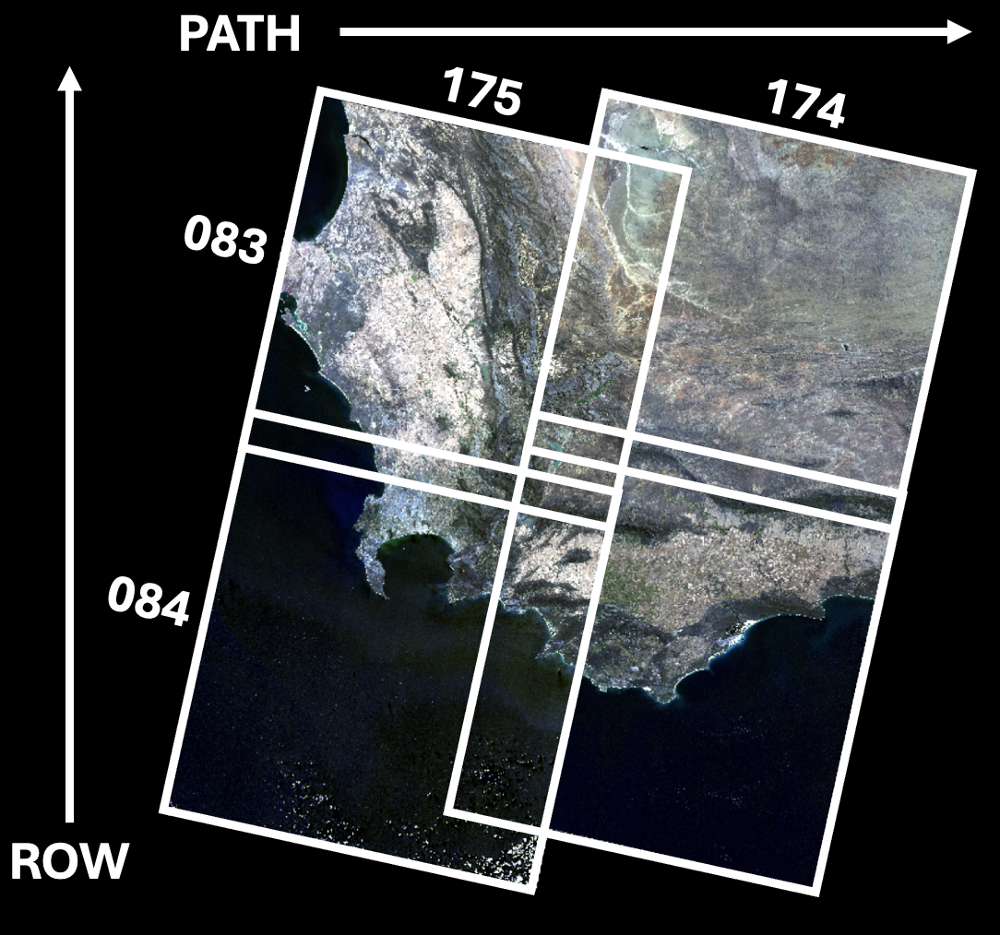
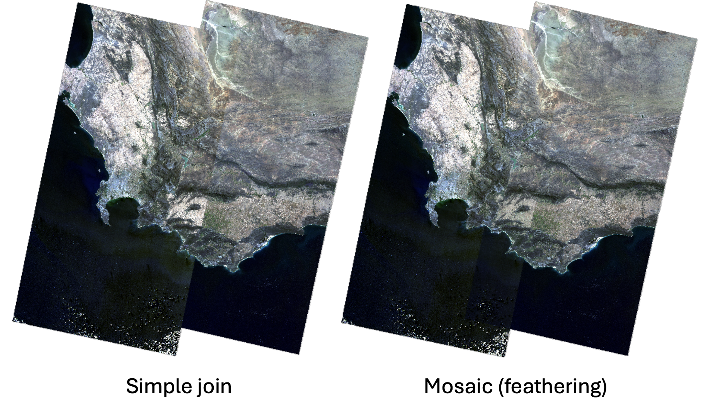
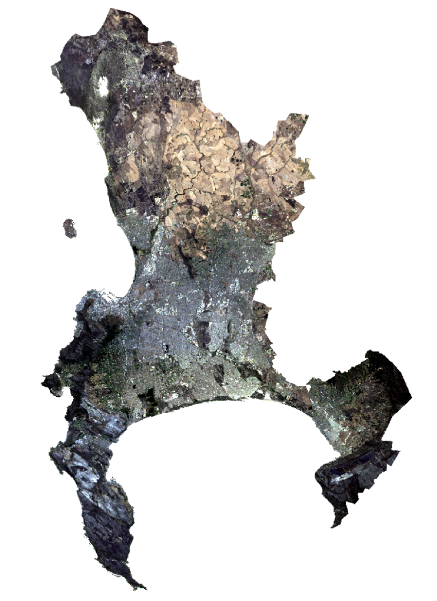
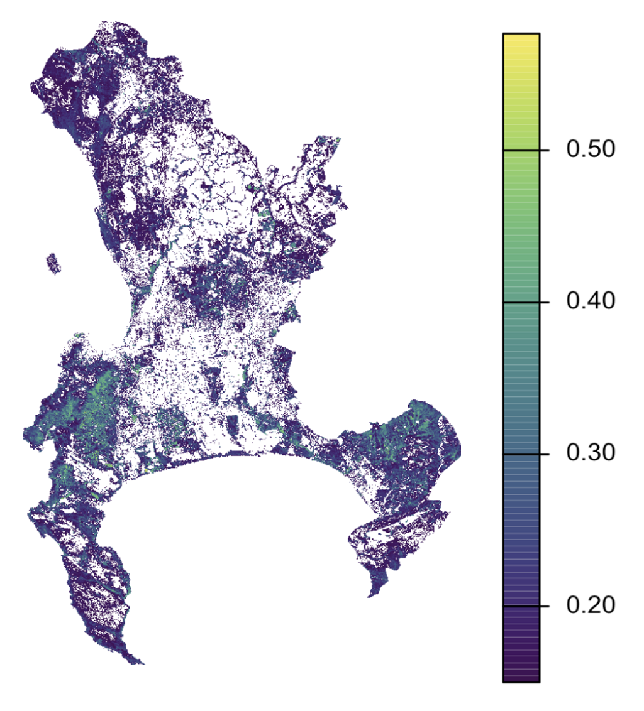
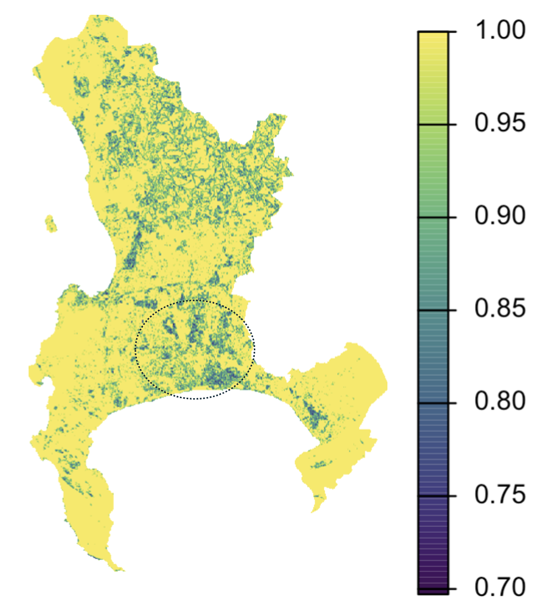

# Enancements {.unnumbered}

## Setting the scene ... Cape Town

Cape Town is one of the biggest cities in Africa (14th largest by population), and most people from around the world will immediately associate it with it's main feature: Table Mountain. The city is located within the bounds of the ocean, and is surrounded around a mountain (57 km squared in size), which is globally recognized as a biodiversity hotspot characterized by the unique Fynbos biome.

The city is also characterised by stark socio-economic disparities that can be seen at small spatial scales, largely as a result of its Apartheid history.

)](images/clipboard-458231652.png)

## Corrections

Corrections are critical steps in remote sensing pre-processing. Although most of the remotely sensed imagery that we would download has already 'corrected', it is important to understand what processes have been taken place to achieve this Analysis Ready Data (ARD).

-   **Geometric corrections:** align images with ground coordinates using Ground Control Points to ensure spatial accuracy

-   **Atmospheric corrections** address environmental factors like scattering and absorption, allowing for consistent comparison of imagery across different times and locations

## Joining Data Sets

Satellite images are limited by the satellite's specific paths and rows (i.e., its route as it moves through space). When we download imagery from sites like Earth Explorer, scenes (images from a unique combination of path and row) are separate from one another, and require merging or mosaicking to join them and create a continous image.

The first option is to do a basic joining of adjacent datasets, which often leads to an image collection with sharp edges between the different images (especially if the images were collected on different days). Furthermore, this technique will only include one image per scene in the final image collection.

Mosaicking is a more complex process that deals with overlapping areas a bit better by blending the overlapping areas together to create a seamless image.

#### Clipping

We then clip our final image to the Cape Town municipal boundary.

## Enhancements

We can use a technique called enhancements to, well, enhance properties (like colour or brightness) of an image to make certain features more easy to see (like buildings, moisture or vegetation).

For **ratio enhancements**, the ratio largely depends on the spectral signature of the object or feature that you want to detect.

### NDVI

The **Normalised Difference Vegetation Index** is a enhancement ratio which utilizes the fact that healthy plants reflect lots of infrared wavelengths and absorb red wavelengths to highlight areas which have healthy vegetation.

$$
NDVI = \frac{NIR - Red}{NIR + Red}
$$

| Value Range | Surface / Land Cover Description |
|----|----|
| -1 to 0 | Water bodies, snow, clouds, non-vegetated surfaces (e.g., buildings) |
| 0 to 0.1 | Barren areas, rocks, sand, or snow |
| 0.2 to 0.5 | Sparse vegetation, shrubs, grasslands |
| 0.6 to 1.0 | Dense, healthy vegetation |

From the image above, we can clearly see the high NDVI values on Table Mountain, and the vegetated areas to the north of the municipality.

### Texture

Texture is an enhancement which gets a sense of the roughness or smoothness of an image by measuring the spatial variation of grey values between each pixel and the pixels that surround it.

The urban informal and urban township areas of the municipality (circled in the figure) are associated with lower texture values, reflective of its more heterogeneous or 'rough' urban form.

### Principle Component Analysis

PCA is a statistical method which reduces the huge amounts of imagery data (which is typical for multi-band satellite imagery with lots of spectral bands) into an uncorrelated, smaller dataset. The resulting first component (PC1) will capture most of the variance within the dataset, while retaining majority of the original information.

|                        |      |      |      |      |      |      |
|------------------------|------|------|------|------|------|------|
| Component              | 1    | 2    | 3    | 4    | 5    | 6    |
| Standard Deviation     | 2,49 | 0,99 | 0,83 | 0,81 | 0,53 | 0,31 |
| Proportion of Variance | 0,69 | 0,11 | 0,08 | 0,07 | 0,03 | 0,01 |
| Cumulative Proportion  | 0,69 | 0,80 | 0,88 | 0,95 | 0,98 | 0,99 |

## Applications

The application of enhancements is unbelievably diverse, and there's pretty much an enhancement or index for most things you can think of - there's a whopping 519 on the spectral [Index Data Base](https://www.indexdatabase.de/db/i.php?offset=1)! From Soil Adjusted Vegetation Index (SAVI), Burn Area Index (BAI) and Normalized Difference Built-up Index (NDBI) to Normalized Difference Snow Index (NDSI).

### The built-up area debate

NDBI is a widely used remote sensing method for detecting built up areas [@Isgenderzade2026]. However, its effectiveness in distinguishing between built-up land and open land in dry, rural regions, such as Bayat Sub-district in Central Java, is limited [@oknisia2025]. More novel approaches are continuously being developed. For example, @Zheng2021 combined NDVI, NDWI, NDBI and Nighttime light (NTL) from the Suomi National Polar-orbiting Partnership Visible Infrared Imaging Radiometer Suite (NPP-VIIRS) to monitor urban built-up areas in the Greater Bay Area. Textural analysis is becoming increasingly used for mapping informal settlements, especially GLCMs [@Matarira2022]. Some consider this method advantageous because of its ability to extract detail like structural information (like irregular density), which spectral indices often miss due building materials having similar spectral signatures [@Matarira2022].

But wait....there's more!

@Mudau2021 found that GLCM textural measures and NDVI performed poorly in separating informal and formal settlements compared to the iron index, built-up area index and coastal blue index.

## Reflections

Given remote sensing's capabilities in providing us with seemingly endless information about the earth's surface,it's easy to forget that it's still a relatively new and rapidly evolving science. A lot is still being discovered, and the more I dug into the 'built-up area debate', the more I felt like I was in an endless loop with no chance of discovering what the correct answer was. This reinforces my takeaway from last week: the 'best' method doesn't exist in isolation. The most effective approach requires a constant, critical evaluation of which methodology actually speaks to the local geographic context. If no methodology exists to achieve a particular goal, maybe it's a good idea to come up with your own or combine others together, like @Zheng2021.

It's also really cool to have read two papers from South Africa - @Mudau2021 from the University of Wits in Johannesburg and @Matarira2022 from University of KZN. It doesn't surprise me that these academics are critical about techniques which are often not transferable to contexts in the Global South (like informal settlements). These data gaps really fascinate me. Even though remote sensing is an incredible opportunity to make data-deficient parts of the world more 'visible', these places often have added layers of social and political complexity, and more critical thinking is required to translate satellite imagery into on-the-ground-contexts.
