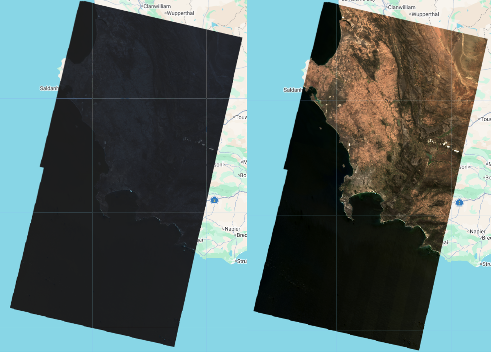
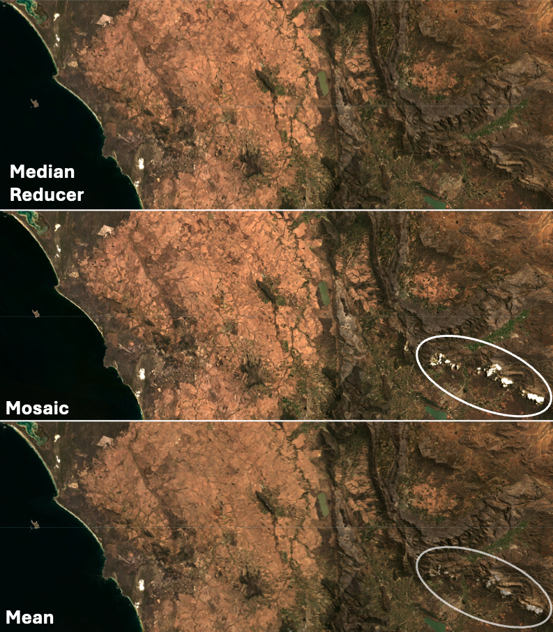
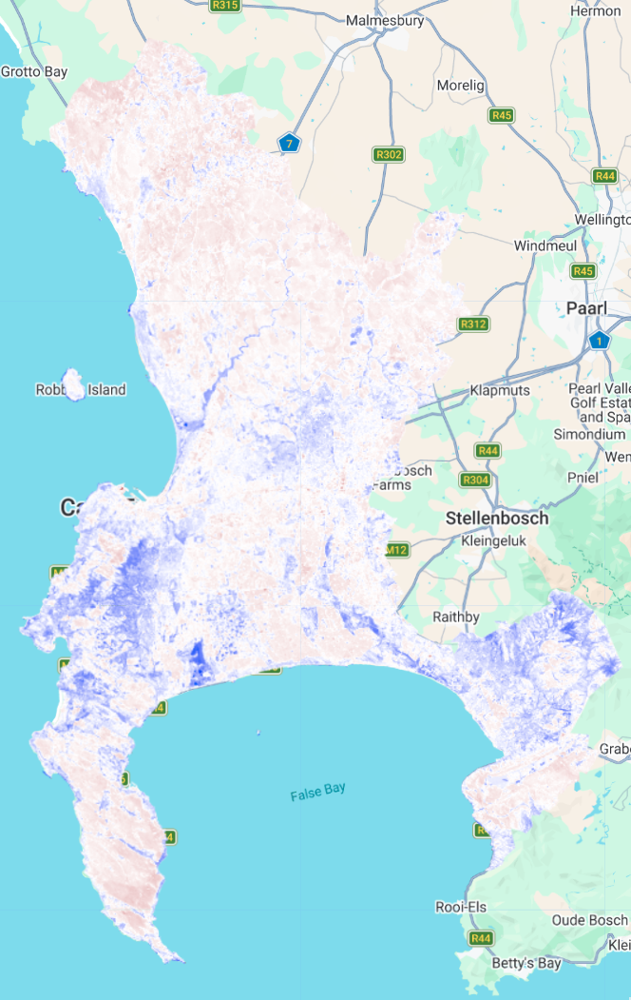
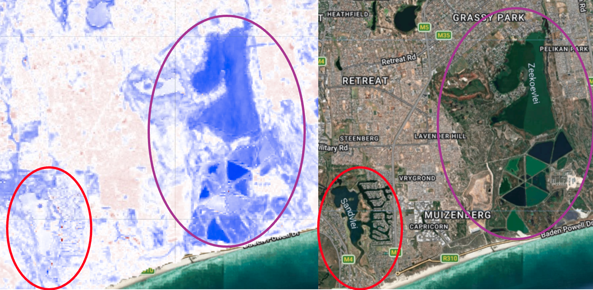

# Google Earth Engine {.unnumbered}

## What is GEE?

GEE is a cloud-based service for local to planetary-scale geospatial analysis. By hosting massive, pre-processed datasets on its servers, it allows users to run complex JavaScript (JS) code without needing to download data locally. This has allowed RS users to shift their focus from time-consuming data management to large-scale research, across an impressive range of fields.

In this page, I will explore the introductory basics of the GEE platform, focusing on my home city - Cape Town in South Africa.

## Accessing Data

JS is used to access data hosted on the GEE API. Each dataset has its own page with additional information, and importantly, a JS code chunk example is provided showing how to access and load the data.

This is the code chunk that GEE provides for the [Global Satellite Mapping of Precipitation](https://developers.google.com/earth-engine/datasets/catalog/JAXA_GPM_L3_GSMaP_v6_operational?_gl=1*vgxgvg*_up*MQ..*_ga*NDMxNDkzMDgxLjE3NzIwMTkwMDY.*_ga_SM8HXJ53K2*czE3NzIwMTkwMDUkbzEkZzAkdDE3NzIwMTkwMDUkajYwJGwwJGgw) dataset:

``` javascript
var dataset = ee.ImageCollection('JAXA/GPM_L3/GSMaP/v6/operational')                   
                  .filter(ee.Filter.date('2018-08-06', '2018-08-07')); 

var precipitation = dataset.select('hourlyPrecipRate'); 
var precipitationVis = {
  min: 0.0,
  max: 30.0,
  palette:
    ['1621a2', 'ffffff', '03ffff', '13ff03', 'efff00', 'ffb103', 'ff2300'],
  }; 
Map.setCenter(-90.7, 26.12, 2);
Map.addLayer(precipitation, precipitationVis, 'Precipitation');
```

GEE also standardizes the architecture of all of its datasets, making swapping between datasets or combining different datasets (eg LandSat and Sentinel) a lot easier than it would be on other platforms since there is no need for reformatting.

## Applying GEE to Cape Town

We loaded a shapefile of municipal boundaries for South Africa (from [GADM](https://gadm.org/download_country.html)) and use this to 'bound' our search for satellite data and only include data which is overlapping this region.

### Scaling

When we first load the data, it comes up dark and we can't see much of what's going on. This is because raw satellite data (like Landsat Level-2 Data of Surface Reflectance) is stored in a compressed format to save space. The compressed format uses a specific scale factor and an additive offset (found [here](https://www.usgs.gov/faqs/how-do-i-use-a-scale-factor-landsat-level-2-science-products)) which must be applied to revert each pixel back to their true physical values.



### Image cloud to a single image

#### Reducing the entire image cloud

When we first loaded the Landsat data for the region (using filters of date, cloud cover etc), it gave us an image cloud containing 5 different images (from multiple dates). To turn the whole collection of images into a single 'best' image, we use a reducer which takes the median (or mean, min, max etc) value for each pixel *across the whole image collection*.

#### Dealing with overlapping tiles only

We could also choose to only deal with the pixels of overlapping tiles, either applying a **mosaic** (which we discussed in the ***Enhancements page***), or by taking the **mean** value of the overlapping pixels across the whole image collection.



We can see above that the median reducer is very effective at removing clouds and shadows, because these are usually 'extreme' values that are excluded in the resulting reduced image.

There's no single 'best' way to do this (which seems to be a recurring theme with RS!). And choosing how to join images will depend on the context: how cloudy the region is, what temporal scales are wanting to be explored etc.

#### Seasonal composites

Using a median reducer across a year's worth of data is usually acceptable for trying to classify objects which change minimally over time (like water, often has the same spectral properties across time\*). Median reducers are the most commonly used method to simplify large amounts of data for classifiers, and it looks something like this:

)](images/clipboard-2223601139.png)

But is there a better way? For anything that undergoes drastic temporal changes, the answer is yes!

What if we took the median composites over seasons rather than the whole year?

)](images/clipboard-4116484766.png)

With this method, a year's worth of pixels is reduced to only 4 numbers per band, but important phenological information is retained. The code to achieve this (taken from [Google Earth](https://www.youtube.com/watch?v=WvaBZbph_cU&t=1725s)) is also really simple:

``` javascript
function seasonalComposite(start) {
  return collection
  .filter(ee.Filter.calendarRange(start, start.add(2), "month"))
  .median()
}

// Make mosaics from months 1-3, 4-6, 7-9, 10-12
var seasons = ee.List([1,4,7,10]).map(seasonalComposite)
var composite = ee.ImageCollection(seasons).toBands()
```

@Immitzer2019 demonstrates the efficacy of this by using multi-temporal Sentinel-2 data to classify tree *species*. Not just forest vs non-forest classification, but individual tree species classification. They found that incorperating imagery from across the entire growing season (and in doing so, including the unique seasonal phenology of each species) significantly improved the accuracy of the classification.

You might be thinking that these seasonal composites are probably only useful for things like vegetation classification. Well, think again!

Instead of land/species cover classification, @Lyu2024 utilized four seasonal Sentinel-2 composites to estimate the number of stories in individual buildings. I won't pretend to understand the complex maths and solar geometry principles that they used, but basically, it uses the idea that in winter, the peak height of the sun is lower than in summer, creating more shadows from buildings. 61 Chinese cities with various building types were included in the study, 47 to train the model and the remaining 14 to test the model.

![Building shadow changes across four seasonal composite images from Sentinel-2, Beijing [@Lyu2024]](images/clipboard-2858265143.png)

This is an insanely cool application of RS, and although the geometric technicalities are a bit beyond me, it shows the versatility of somewhat simple concepts, like seasonal composites, in solving complex problems at scale.

## Feature Enhancements

One of the best parts in GEE is that we can quickly and easily implement feature enhancements to get a summary of some of the features in an area.

### Texture


The residential area (which is mainly comprised of informal settlements) is characterized by pixels that have high contrast with their surrounding pixels and irregular changes in reflectance. The agricultural area is much more uniform, which makes sense given the homogenous nature of the mono-culture farming that occurs here.

### NDMI (moisture)

The Normalized Difference Moisture Index tells us where there are high levels of moisture.



For the most part, I think the NDMI captured the moisture landscape of Cape Town Pretty well! The more densely vegetated areas of the mountain are dark blue, while the drier, more sandy soils of the southern peninsula are more pink/red showing less moisture. Something I did find slightly interesting was this discrepancy between two of the vleis (small wetlands) located in the heart of the city, pictured below:



The red colour is outlining Sandvlei and the purple outlines Zeekoevlei. Both are filled with water in the satellite image, but according to the NBMI, only Zeekoevlei has a high moisture value. I haven't been able to get to the bottom of this, but it might have something to do with sandvlei being shallower and having more clear water than zeekoevlei (which is deeper and has more algae/micro organism content).

## Reflections

#### The pros

The speed at which different functions and processes run in comparison to R or SNAP (if I can even mention this because it was so clunky I couldn't even get it to work!) is amazing. Probably the most notable improvement for me was the ease at which you can interact with the data. Being able to toggle between different layers makes it so much easier to investigate different aspects of the landscape and notice interesting patterns or features ... which is exactly how I found discrepancies like the different NDMI values of the two vleis. Another major advantage of GEE over other platforms is eliminating the need to download large, confusingly-named satellite images onto local drives.

#### The cons

Having to run the entire script every time you want to add or change something instead of line-by-line or by chunk does seem like a major flaw, and one which I feel could be avoided quite easily. For the analysis I did, this didn't slow down the process too much since I was working with quite a small geographic area, but I am skeptical about how this would impact the efficiency of larger-scale analysis. Although you can make some comments in the code (after //), this is definitely not as nice as something like a quarto or markdown document in R.

Overall, I really enjoyed using GEE, and although there are elements of the GEE interface that are annoying... the pros *without a doubt* outweigh the cons.
