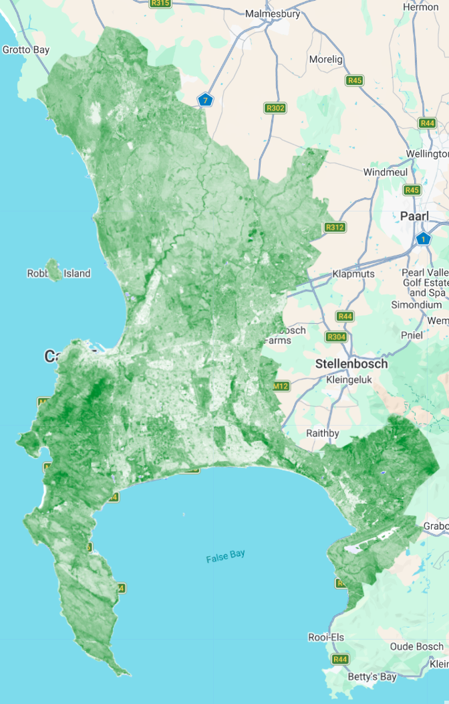

# Google Earth Engine {.unnumbered}

## What is GEE?

GEE is a cloud-based geospatial service that allows for the analysis of massive datasets at planetary scale, all completed incredibly quickly. GEE stores an unbelievable amount of Earth Observation data (much of which is already pre-processed) on its servers, and users are able to run complex tasks (controlled via JavaScript code) without needing to download data to their local machines. This has revolutionized how scientists can use this data, shifting from a download and pre-processing intensive workflow to allowing people to focus on large-scale research in countless fields.

In this page, I will explore the introductory basics of the GEE platform, focusing on my home city - Cape Town in South Africa.

## Accessing Data

JavaScript (JS) is used to access data hosted on the GEE API. GEE provides a really nice Data Catalog, which groups the datasets into general themes (like climate & weather, imagery and geophysical) which you can easily and intuitively explore. Each dataset has its own page with additional information, and importantly, a JS code chunk example for how to access the data.

This is the code chunk that GEE provides for the [Global Satellite Mapping of Precipitation](https://developers.google.com/earth-engine/datasets/catalog/JAXA_GPM_L3_GSMaP_v6_operational?_gl=1*vgxgvg*_up*MQ..*_ga*NDMxNDkzMDgxLjE3NzIwMTkwMDY.*_ga_SM8HXJ53K2*czE3NzIwMTkwMDUkbzEkZzAkdDE3NzIwMTkwMDUkajYwJGwwJGgw) dataset:

``` javascript
var dataset = ee.ImageCollection('JAXA/GPM_L3/GSMaP/v6/operational')                   
                  .filter(ee.Filter.date('2018-08-06', '2018-08-07')); 

var precipitation = dataset.select('hourlyPrecipRate'); 
var precipitationVis = {
  min: 0.0,
  max: 30.0,
  palette:
    ['1621a2', 'ffffff', '03ffff', '13ff03', 'efff00', 'ffb103', 'ff2300'],
  }; 
Map.setCenter(-90.7, 26.12, 2);
Map.addLayer(precipitation, precipitationVis, 'Precipitation');
```

GEE also standardizes the architecture of all of its datasets, making swapping between datasets or combining different datasets (eg LandSat and Sentinel) a lot easier than it would be on other platforms as there is no need for reformatting.

## Applying GEE to Cape Town

One of the nice parts of GEE is that it deals with raster data really well, but it also does for vector data. We loaded a shapefile of municipal boundaries for South Africa (from [GADM](https://gadm.org/download_country.html)) and use this to 'bound' our search for satellite data and only include data which is overlapping this region.

### Scaling

When we first load the data, it comes up dark and we can't see much of what's going on. This is because raw satellite data (like Landsat Level-2 Data of Surface Reflectance) is stored in a compressed format to save space. The compressed format uses a specific scale factor (in our case 0.0000275) and an additive offset (-0.2) which must be applied to revert each pixel back to their true physical values. Different Landsat collections of data have different scale factors and offsets, which can be found [here](https://www.usgs.gov/faqs/how-do-i-use-a-scale-factor-landsat-level-2-science-products). Once we've transformed this, the image looks a lot more like what we would expect:


### Image cloud to a single image

#### Reducing

When we first loaded the Landsat data for the region (using filters of date, cloud cover etc), it gave us an image cloud containing 5 different images (from multiple dates). To turn the whole collection of images into a single 'best' image, we use a reducer which takes the median value for each pixel across the whole image collection. Applying the median reducer is very effective at removing clouds and shadows, because these are usually 'extreme' values that are excluded in the resulting reduced image.

#### Mosaic

Applying a mosaic to the image collection creates a single image by layering tiles on top of each other based on their order in the collection.

#### Mean

We can also take the average value of the overlapping pixels for the whole image collection.


## Feature Enhancements

One of the best features in GEE is that we can quickly and easily implement feature enhancements to get a summary of some of the features in an area ... what land types is covering it, how much water is there, how healthy is the vegetation, how much of the area is built up? More detailed information about enhancements was discussed ***here***, but for now let's have a look at what's happening in Cape Town!

### Texture

Let's look side-by-side at a residential area and an agricultural area at the same zoom level to explore what the colours in the texture map mean.


On the left hand side, we have a residential area (mainly comprised of informal settlements) with lots of bright pink. This is telling us that the pixels in this area of the map are characterized by high contrast with their surrounding pixels, and there are irregular changes in reflectance.

On the left, we have an agricultural area which is much darker. We can see from the satellite image that the fields/vegeatation in this area is, for the most part, quite uniform with not a lot of changes in colour or reflectance (other than the odd road or clump of buildings).

### NDVI (vegetation)

{width="300 "}

Here is a map of NDVI for Cape Town...basically, a map which shows where there is vegetation.

We can immediately see that Cape Town has **a lot** of vegetation. It is also pretty easy to spot Table Mountain (west section of the city) and the Hottentots Holland Mountains (to the east side), which is a lot darker green than the rest of the city.

### NDMI (moisture)

Similar to the NDVI calculation, we can calculate the Normalized Difference Moisture Index as a way to see where there are high levels of moisture.


For the most part, I think the NDMI captured the moisture landscape of Cape Town Pretty well! The more densely vegetated areas of the mountain are dark blue, while the drier, more sandy soils of the southern peninsula is more pink/red showing less moisture. Something I did find slightly interesting was this discrepancy between two of the vleis (small wetlands) located in the heart of the city, pictured below:


The red colour is outlining Sandvlei and the purple outlines Zeekoevlei. Both are filled with water in the satellite image, but according to the NBMI, only Zeekoevlei has a high moisture value. I haven't been able to get to the bottom of this, but it might have something to do with sandvlei being shallower and having more clear water than zeekoevlei (which is deeper and has more algae/micro organism content).

## Reflections

#### The pros

The speed at which different functions and processes run in comparison to R or SNAP (if I can even mention this because it was so clunky I couldn't even get it to work!) is amazing. Probably the most notable improvement for me was the ease at which you can interact with the data. Being able to toggle between different layers makes it so much easier to investigate different aspects of the landscape and notice interesting patterns or features ... which is exactly how I found discrepancies like the one in ***figure x***. Another major advantage of GEE over other platforms is eliminating the need to download large, confusingly-named satellite images onto local drives.

#### The cons

Having to run the entire script every time you want to add or change something instead of line-by-line or by chunk does seem like a major flaw, and one which I feel could be avoided quite easily. For the analysis I did, this didn't slow down the process too much since I was working with quite a small geographic area, but I am skeptical about how this would impact the efficiency of larger-scale analysis. Although you can make some comments in the code (after //), this is definitely not as nice as something like a quarto or markdown document in R.

Overall, I really enjoyed using GEE, and although there are elements of the GEE interface that are annoying... the pros *without a doubt* outweigh the cons.
