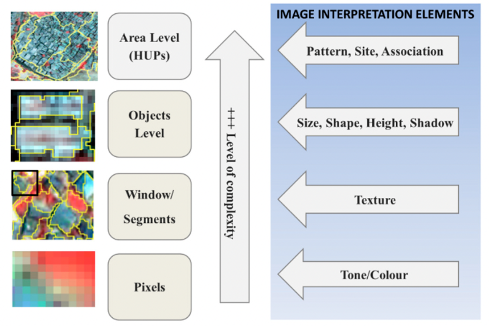

# Classification (part 1) {.unnumbered}

Building from the content in the previous section on ***Google Earth Engine,*** we move onto running our own classification algorithms.

First, we'll run through a brief step-by-step of how you run a classification. I've included a lot of code chunks in between text here to show just how quick and easy it is to run this in GEE.

## Step-by-step

### Step 1: Get Training Data

We do this by drawing polygons around areas of known land cover type.

{width="300"}

### Step 2: Split pixels into training & validation

We want to retain a portion of the above training data to validate/test our classification model. It is important to make this split by pixels rather than polygons, because...**xyz**

To do this we:

1.  Select a number of pixels (1000) from each class

``` javascript
var pixel_number= 1000;

var water_points=ee.FeatureCollection.randomPoints(water, pixel_number).map(function(i){
  return i.set({'class': 1})})
  
// repeat for each class
```

2.  Assign random numbers to the pixels

``` javascript
var point_sample=ee.FeatureCollection([mountain,
                                  urban,
                                  agricultural,
                                  water,
                                  sand])
                                  .flatten()
                                  .randomColumn();
```

3.  Split the pixels into two groups: training (70%) or validation (30%)

``` javascript
var split=0.7
var training_sample = point_sample.filter(ee.Filter.lt('random', split));
var validation_sample = point_sample.filter(ee.Filter.gte('random', split));
```

This means that 70% of the data will be seen by the model and used to train it, and once the model is trained we will test how accurately it performs on the remaining 30% of the data (which it has never seen before).

4.  Extract the values of the pixels for each group.

``` javascript
var training = waytwo_clip.select(bands).sampleRegions({  
  collection: training_sample,  
  properties: ['class'],  
  scale: 10,
});

var validation = waytwo_clip.select(bands).sampleRegions({  
  collection: validation_sample,  
  properties: ['class'],  
  scale: 10
});
```

Scale here is the resolution that is used to extract values. Here, it is 10m (the resolution of Sentinel 2 Imagery). If we were worried about memory we could increase the scale, and each 10m x 10m pixel would be re-sampled to a larger resolution.

### Step 3: Train the model

This step is achieved in just ONE line of code! We chose to use the random forest model here.

``` javascript
var rf1_pixel = ee.Classifier.smileRandomForest(100)
    .train(training, 'class');
```

### Step 4: Conduct classification

Here, we apply our trained model from the previous step to our study area image, and add this as a layer on the map.

``` javascript
var rf2_pixel = waytwo_clip.classify(rf1_pixel);

Map.addLayer(rf2_pixel, {min: 1, max: 5, 
  palette: [
  '466b9f', // water
  '999999', // residential
  'a07905', // agricultural
  '38761d', // mountain
  'ffe02a', // sand
  ]},
  "RF_pixel");
```

### Step 5: Validating & assessing accuracy

To assess the training model's accuracy pre-validation:

``` javascript
var trainAccuracy = rf1_pixel.confusionMatrix();
```

To validate the model and assess its accuracy:

``` javascript
var validated = validation.classify(rf1_pixel);

var testAccuracy = validated.errorMatrix('class', 'classification');
var consumers=testAccuracy.consumersAccuracy()
```

## Classification models

There are a number of different classification models that you can choose to use in GEE, but we are only going to focus on two.

### CART


The CART model constructs a binary decision tree by recursively splitting data into subsets that minimize impurity, balancing the risk of over-fitting against model simplicity.

### Random Forests


Random Forest improves on CART by creating an *forest* of decision trees through 'bagging.' By training each tree on a random subset of data and features, the model uses a 'majority vote' to classify pixels, providing a more robust result than a single tree.

## Applications: Informal Settlement mapping

CASA's Ollie Ballinger used a random forest classifier to identify and map informal settlements in Dar es Salaam, Tansania. The GEE app can be found [here](https://ollielballinger.users.earthengine.app/view/ism), the code for the app [here](https://code.earthengine.google.com/065e25995dbe069beec41883b79b2ca9), and a very in-depth explanation of the code [here](https://oballinger.github.io/CASA0025/W08_ISM.html).

Ballinger used nearly identical methods to the step-by-step above, with a few additional steps. Firstly, NDVI and NDBI we calculated and used to filter out non-urban landcover from the imagery (only pixels with NDVI \< 0.3 and NDBI \> 0 were included in the classification). Secondly, he included OSM **building footprint data** in the classification.

The reciprocal of each building footprint's area was added and converted into a raster, then a Gaussian kernel was used to calculate the density of small buildings in a given area.

)](images/clipboard-1248978210.png)

When this is applied to the entire layer, the result is a raster layer that can be used to identify areas with high building density, which are likely to be informal settlements:

)](images/clipboard-738491898.png)

The building density raster layer was used as one of the inputs in the classification training (alongside B2, B3, B4, B8, B8A, B11, B12, NDVI, B8_contrast).

So how did the classification actually perform?

Ballinger doesn't show the results of the accuracy assessment, so we're left to do our own visual assessments of how the model performed:

![Zoomed in view of an informal settlement (delineated in between the black lines) and formal settlements, Dar es Salaam. From left to right: Sentinel Imagery; OSM Building footprints; Random Forest Classification (without building density); Random Forest Classification (with building density). Note: The delineation of informal settlements was drawn subjectively based off Sentinel imagery using well-known features of informal settlements - such as the presence of metal roofing and branching nature of road networks. ](images/clipboard-1328210847.png)

Including building density as an input in the RF classification model resulted in a more contiguous classification of informal settlements. Excluding it from the model resulted in the classification being more fragmented and dispersed.

This method, to my knowledge, is not well-documented in the literature, so it's difficult to compare it to other methodologies. To try and place it within the wider field of remote sensing to identify informal settlements, consider @kuffer2016's systematic review of 15 years of scientific literature (2000–2015) focused on this exact application. The review highlighted the following morphological features as being the most important in informal settlements:

-   Size (smaller buildings)

-   Density (high roof coverage density & lack of public green spaces)

-   Pattern (organic layout structure with no orderly road arrangement)

-   Site characteristics (Further proximity to infrastructure, and often hazardous locations like flood prone areas or on steep slopes)

@kuffer2016 found a clear evolution in the field: an advance in methodologies which incorporate increasingly complex morphological features. This is summarized in the figure below:



So far, we've only worked with pixel-based classification, which the above figure classifies as the simplest of the methods, only considering tone and colour as the main input to train the model.

So where does Ballinger's method fit?

The methodology clearly sits within pixel-based classification, but Ballinger goes beyond the tone and colour elements and is able to capture elements of size and density into the pixel-based classification by applying the Guassian kernel calculation on reciprocal building footprint areas. This seems like a really innovative way to incorporate more complex features into less computationally intensive algorithms.

## Reflection

It's quite crazy to think that Ballinger was able to achieve what seems like a really good model for detecting informal settlements, and that was using the most simple of the four methodologies that @kuffer2016 outlined. The sheer amount of papers which are focused on improving the identification of informal settlements makes me quite hopeful. This is an area which is often under-represented in the literature, but it seems like that's not the case for RS studies (although, maybe there is also an element of confirmation bias here since I did fall into a bit of a rabbit whole with this topic!). The fact that so much of the freely-available satellite imagery has a global extent means that people who care about and are interested in these under-represented areas are less limited by the data-deficiency that they so often face. Although there are *always* political and social biases embedded in any sort of representation of the real world, it seems like RS offers one of the least bias of these representations.

I thoroughly enjoyed learning about classification, and, even more so, seeing how easy it is to implement in GEE (phew!). It seems like a very practical and relevant topic, and one which can be applied to a broad range of fields. I'm excited to delve even deeper next week!

## NOT TO BE MARKED: 

## A tangent on how we deal with clouds

### Option 1: Cloudy pixel percentage

Most of the satellite imagery data comes with a bunch of metadata about the imagery. One of these pieces of information is the CLOUDY_PIXEL_PERCENTAGE, which represents the cloud cover for the **entire tile**. In this method, we would filter the entire collection of images based on a given cloud coverage (in our case 1%):

``` javascript
var way_one = ee.ImageCollection('COPERNICUS/S2_SR_HARMONIZED')
                  .filterDate('2022-01-01', '2022-10-31')
                  .filterBounds(capetown)
                  // Only include images where clouds 
                  // cover less than 1% of the tile
                  .filter(ee.Filter.lt('CLOUDY_PIXEL_PERCENTAGE',1));
```

### Option 2: Quality Assurance

In this method, we filter the entire collection of images with a much higher cloud percentage per tile (20%), but now look into another band of the imagery called Quality Assurance (QA60). This is basically a special bitmask layer where the satellite's algorithms have flagged specific pixels as "Cloud" or "Cirrus". We use the QA60 band to create a function, maskS2clouds:

``` javascript
function maskS2clouds(image) {
  var qa = image.select('QA60');

  // Bits 10 and 11 are clouds and cirrus, respectively.
  var cloudBitMask = 1 << 10;
  var cirrusBitMask = 1 << 11;

  // Both flags should be set to zero, indicating clear conditions.
  var mask = qa.bitwiseAnd(cloudBitMask).eq(0)
      .and(qa.bitwiseAnd(cirrusBitMask).eq(0));

  return image.updateMask(mask).divide(10000);
}
```

Basically, this function takes each image and looks for any pixels flagged as clouds or cirrus, and makes them transparent. We then map this function across the image collection:

``` javascript
var way_2two = ee.ImageCollection('COPERNICUS/S2_SR_HARMONIZED')
                  .filterDate('2022-01-01', '2022-10-31')
                  .filterBounds(capetown)
                  // More lenient with cloudy cover
                  .filter(ee.Filter.lt('CLOUDY_PIXEL_PERCENTAGE',20))
                  // Map function across image collection
                  .map(maskS2clouds);
```

The result should be an image collection with clouds/cirrus removed from each image. To this, we then apply a median reducer to create a single image and filter out any clouds that were not asked out with the maskS2clouds function.

### Comparison of the 2 methods

Option 1 is very fast and computationally "cheap", while option 2 involves more complex code and more processing power. One of the main disadvantages of option 1 is that it is very restrictive with image selection. Here's a *very* basic figure to help visualize a situation where this would be a problem:


In the above figure, tile 2 probably has around 40% and tile 3 around 5%. If we set our limit of cloudy pixel percentage to 1%, both of these images wouldn't have been included in the image collection even though **none over the clouds were covering our study area**. This is where option 2 would be much more beneficial, as this isn't as strict about filtering out cloudy images and deals with clouds by masking them out.
