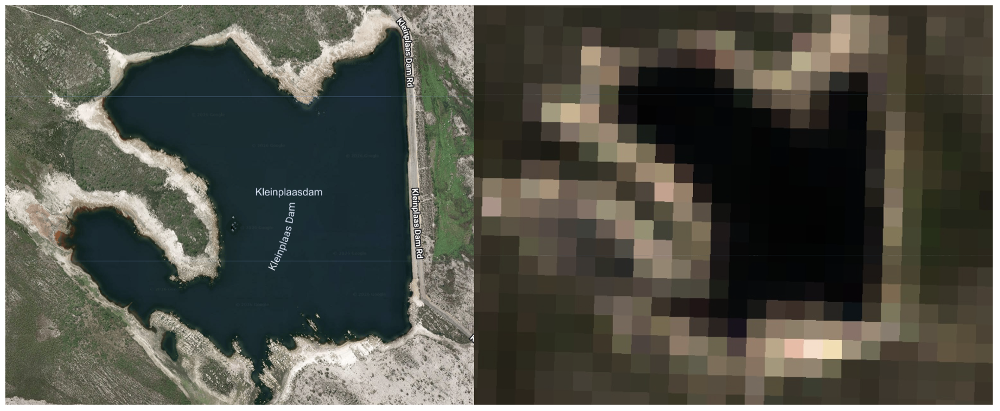
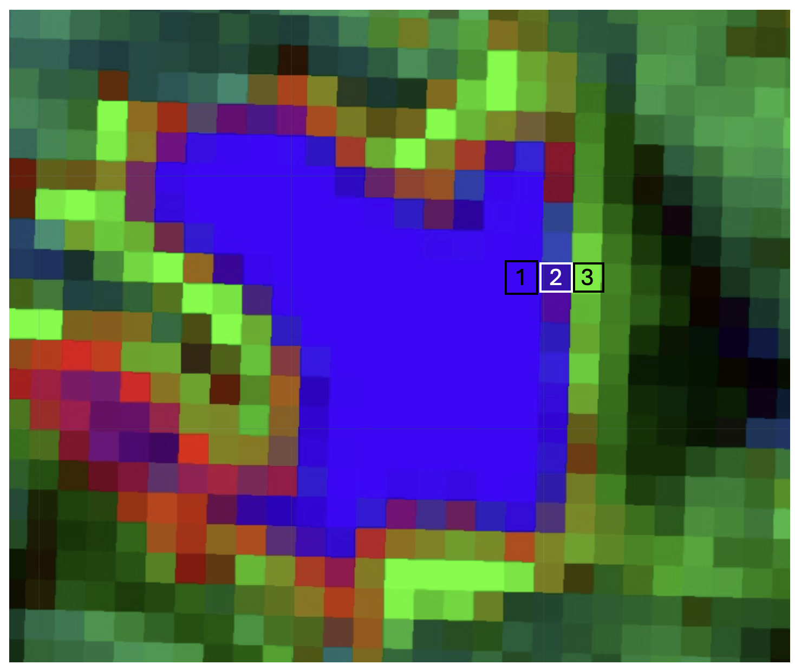
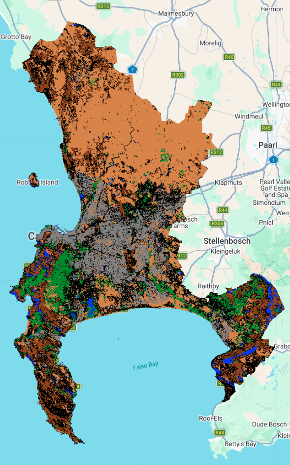
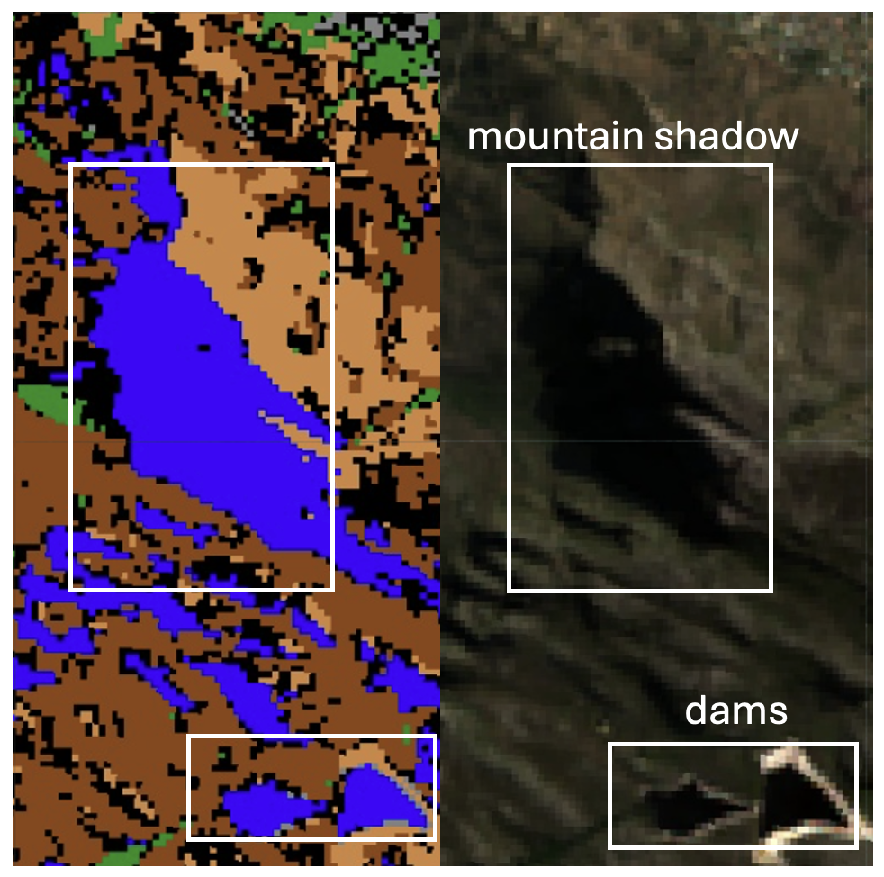
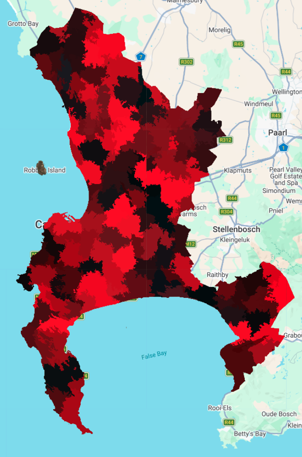

# Classification (part 2) {.unnumbered}

This week, we dig a bit deeper into classification algorithms and explore sub and super pixel analysis.

## Sub-pixel analysis

### Multiple land covers within a pixel

What happens when multiple land covers appear within a single pixel? Take this image below of one of the dams on Table Mountain. The inner area of the dam can be considered 'spectrally pure' - 100% of these pixels are comprised of water. However, the outer edges of the dam represent a mixture of water and sand.

To deal with this, we draw points or polygons of 'spectrally pure' pixels for each of the end members (which are basically just the land types we want to be classified). I chose 5 different end members:

1.  Urban
2.  Agricultural
3.  Water
4.  Forest
5.  Mountainous

### Spectral unmixing

We then conduct spectral unmixing, whereby the reflectance value of every pixel is compared to the spectrally pure end member values. The algorithm then infers what the proportion of each land cover type is within each pixel. Let's go back to the dam example to see what these fractions actually look like...

| End member   | Pixel 1   | Pixel 2 | Pixel 3 |
|--------------|-----------|---------|---------|
| Urban        | 0         | **22**  | 7       |
| Agricultural | 0         | 6       | **93**  |
| Water        | **99.99** | **70**  | 0       |
| Forest       | 0         | 0       | 0       |
| Mountain     | 0         | 2       | 0       |

So we can see a gradient being established from 'spectrally pure' water to 'spectrally pure' sand (or agricultural land, since I didn't make sand its own end member), with the inbetween value being a bit 'fuzzy'.

### Reclassification

We then use the values of these fractions to reclassify the image (into only the 5 categories of land cover, rather than the proportions of each). We do this by 'hardening' the sub-pixel image and classify each pixel that is above a given threshold of land cover. We used a threshold of 50% and 70% (i.e., a pixel is classified into a given land type when it's proportion exceeds 50% or 70%).

The algorithm appears to have performed relatively well. I specifically assign pixels which had no dominant pixel proportion to a black colour, so that we can see in which areas there was high spectral mixing (i.e., high uncertainty for classification).

An area in which the algorithm didn't perform well was with mountain shadows, which returned high proportions of the water end member and were thus classified as such. This probably could have been avoided by including an NDVI or NDWI index as one of the inputs in the classification.

### 

## Super-pixel analysis

Instead of breaking pixels into smaller parts, super-pixel analysis, or object-based image analysis (OBIA) groups similar pixels together. Below is the output of the clusters formed using the simple non-iterative clustering (SNIC) method.

It seems as though the heterogeneous nature of the landscape means that the output is rather noisy, and I am not quite sure what information can be extracted from an output like this. But the utility of it elsewhere is clear...

## Applications

@amani2020 produced the 2018 Annual Space-Based Crop Inventory (ACI) map for Canada, and describes the methodology for doing so. To capture crop phenology and temporal patterns (remember this from ***seasonal composites***!), the study extracted 18 total feature layers for the year 2018:

-   SAR: Bi-monthly mean values for VV and VH polarizations (12 features)

-   Optical: Four-month median composites of NDVI and NDWI (6 features)

This 18-layer stack was processed using the SNIC algorithm, grouping pixels into segments to reduce noise and improve classification reliability.

![Results of applying SNIC algorithm to croplands in Canada [@amani2020]](images/clipboard-3187778873.png)

An Artificial Neural Network (ANN) algorithm was then used to classify each object into one of 17 different crop classes. The accuracy assessment produced the following results:

-   Overall Accuracy = 77%

-   Kappa Coefficient = 0.74

-   Producer Accuracy = 79%

-   User Accuracy = 77%

These are impressive results, especially considering the study area was approximately 2.803 million $km^2$ across 10 provinces, representing about 28% of Canada's terrestrial landmass.

Object-based Image Analysis has been used to map informal settlements across the world [@kuffer2016], from Durban, South Africa [@Matarira2023] to Pune, India [@shekhar2012].

![Map of 87 publications mapping informal settlements using RS methods [@kuffer2016]](images/clipboard-193300748.png)

Between 2000 and 2015, OBIA was the most common method used to do map informal settlements, comprising 32% of all publications on the topic [@kuffer2016]. However, @kohli2013 found that while high-level form and morphology of informal settlements are transferable, the specific rules and thresholds selected in OBIA are not. Differences in local building materials, roof colors, and urban density meant that a rule set created for Ahmedabad required significant manual 'calibration' to work in Kalyan [@kohli2013]

## Reflection

Once again, local context is essential for accurate classification. It's quite crazy to think that @amani2020 was able to classify croplands into 17 different crop classes for over a quarter of the country's landmass, while @kohli2013 found that the accuracy of mapping informal settlements just 500km apart was completely different. This speaks to the much more complex, random, opportunistic nature of informality and its morphology. It is much harder to capture the finer details of informality than formality, and as a result requires much more in-depth consideration of the methodology.

I have focused a lot of my reflections on debates on **how** best to go about classifying things like informal settlements, and not really paid any attention to the **why**. Understanding more about the way in which informal settlements expand, contract, diverge, converge is extremely important for predicting how they will change in the future.

In doing my own classification of Cape Town, it was sometimes easy to be a bit pessimistic about the results sometimes. Seeing a map of a landscape I know extremely well, with quite a lot of mistakes (mountain shadows classified as water...), seemed a bit pointless. But an important distinction that the @amani2020 paper made me realize is scaleablity. And no, I'm not saying that it would be useful to do a sub-par classification of the whole of South Africa. I mean that, the scale at which you consider the context (*are those big dams or mountain shadows? ... is the roof fabric of this informal settlement different to its neighboring one? ... is the phenology of this crop different to another?*), is the scale at which you will be able to effectively apply your classification.
