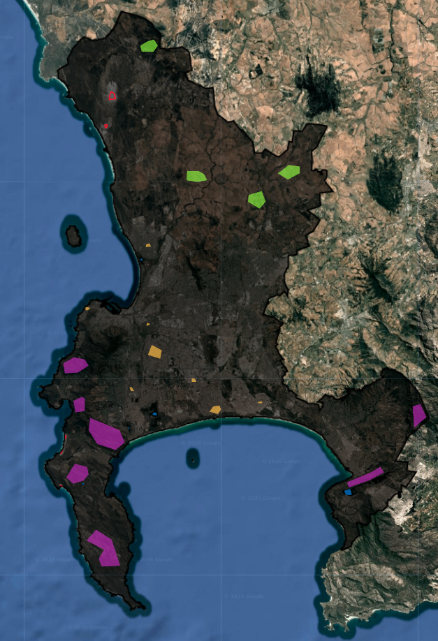
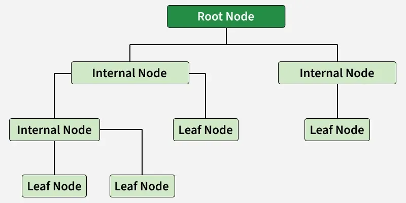
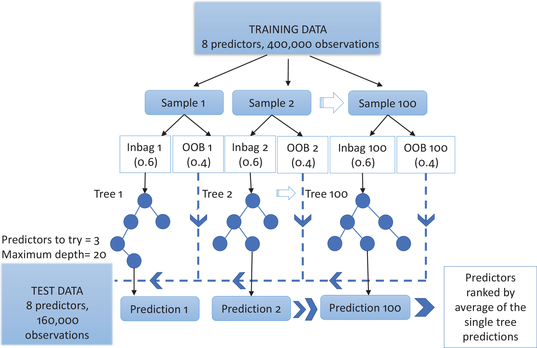
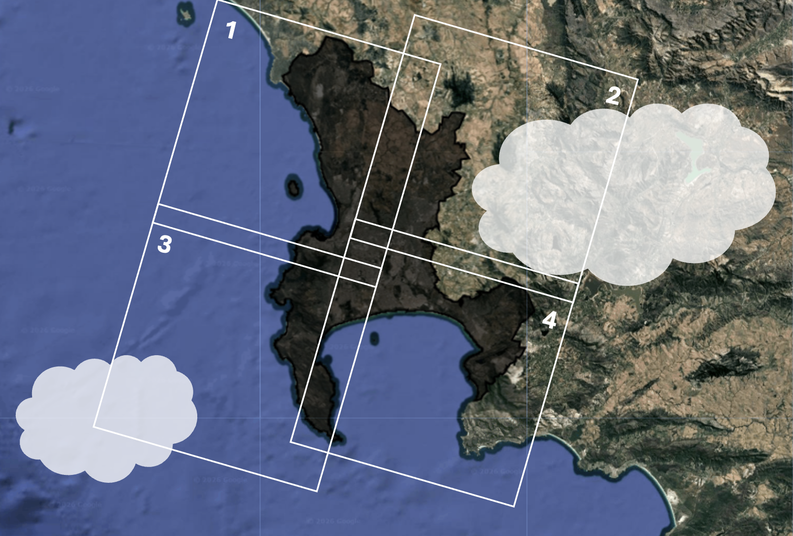

# Classification I {.unnumbered}

There's a lot of code chunks in between text. I decided to include this to show just how easy and intuitive all of this is.

## Step 1: Get Training Data

The first step of classification (irrespective of what type of model you are going to use) is to get some training data. We do this using the GEE draw polygon tool, creating a different layer for each land cover type.

{width="300"}

## Step 2: Split pixels (training or validation)

We want to retain a portion of the above training data to validate/test our classification model. It is important to make this split by pixels rather than polygons, because...**xyz**

To do this we:

1.  Select a number of pixels from each class

``` javascript
var pixel_number= 1000;

var water_points=ee.FeatureCollection.randomPoints(water, pixel_number).map(function(i){
  return i.set({'class': 1})})
  
// repeat for each class
```

2.  Assign random numbers to the pixels

``` javascript
var point_sample=ee.FeatureCollection([mountain,
                                  urban,
                                  agricultural,
                                  water,
                                  sand])
                                  .flatten()
                                  .randomColumn();
```

3.  Split the pixels into two groups: training (70%) or validation (30%)

``` javascript
var split=0.7
var training_sample = point_sample.filter(ee.Filter.lt('random', split));
var validation_sample = point_sample.filter(ee.Filter.gte('random', split));
```

This means that 70% of the data will be seen by the model and used to train it, and once the model is trained we will test how accurately it performs on the remaining 30% of the data (which it has never seen before).

4.  Extract the values of the pixels for each group.

``` javascript
var training = waytwo_clip.select(bands).sampleRegions({  
  collection: training_sample,  
  properties: ['class'],  
  scale: 10,
});

var validation = waytwo_clip.select(bands).sampleRegions({  
  collection: validation_sample,  
  properties: ['class'],  
  scale: 10
});
```

Scale here is the resolution that is used to extract values. Here, it is 10m (the resolution of Sentinel 2 Imagery). If we were worried about memory we could increase the scale, and each 10m x 10m pixel would be re-sampled to a larger resolution.

## Step 3: Train the model

This step is achieved in just ONE line of code! We chose to use the random forest model here.

``` javascript
var rf1_pixel = ee.Classifier.smileRandomForest(100)
    .train(training, 'class');
```

## Step 4: Conduct classification

Here, we apply our trained model from the previous step to our study area image, and add this as a layer on the map.

``` javascript
var rf2_pixel = waytwo_clip.classify(rf1_pixel);

Map.addLayer(rf2_pixel, {min: 1, max: 5, 
  palette: [
  '466b9f', // water
  '999999', // residential
  'a07905', // agricultural
  '38761d', // mountain
  'ffe02a', // sand
  ]},
  "RF_pixel");
```

## Step 5: Validating & assessing accuracy

To assess the training model's accuracy pre-validation:

``` javascript
var trainAccuracy = rf1_pixel.confusionMatrix();
```

To validate the model and assess its accuracy:

``` javascript
var validated = validation.classify(rf1_pixel);

var testAccuracy = validated.errorMatrix('class', 'classification');
var consumers=testAccuracy.consumersAccuracy()
```

## Different models

There are a number of different classification models that you can choose to use in GEE, but we are only going to focus on two.

### CART



The Classification and Regression Trees (CART) model constructs a binary decision tree, which can deal with both categorical and continuous outcome variables. It does this by recursively splitting the dataset into smaller subsets which best minimize the sum of squared residuals (continuous data) and the Gini Impurity (discrete data). It continues to make these splits until the optimal decision tree is made, which roughly balances over-fitting (where the model has too many branches and struggles to classify data that it hasn't seen before) and under-fitting (the model incorrectly classifies).

### Random Forests



Random Forests are similar to CARTs, but instead of coming up with just one decision tree, the result is a 'random forest' of loads of decision trees. It does this by taking a bunch of bootstrap samples of the training data. Within each bootstrap sample, about two thirds are kept 'in the bag' and one third is 'out of the bag' (OOB). The data kept in the bag is used to train the model, and create a decision tree. During this process, every time a node is reached, the tree can only choose from a random selection of independent variables (in our case, this is our spectral bands). Once the decision tree is made, we then use the OOB data (which the model has never seen) to see how that individual decision tree performs...and this gives us the OOB error.

When we use the resulting random forest model to classify a pixel, all of the decision trees in the forest "vote" simultaneously to give the best prediction. The performance of this model is validated against the 30% of the **training data** that was held back from the whole random forest model to begin with. This is a bit of a confusing detail...but basically, the OOB error is an 'internal' check that happens for each bootstrap sample, and validation is the 'external' check that is applied to the model that we get at the end.

## How do we deal with clouds?

### Option 1: Cloudy pixel percentage

Most of the satellite imagery data comes with a bunch of metadata about the imagery. One of these pieces of information is the CLOUDY_PIXEL_PERCENTAGE, which represents the cloud cover for the **entire tile**. In this method, we would filter the entire collection of images based on a given cloud coverage (in our case 1%):

``` javascript
var way_one = ee.ImageCollection('COPERNICUS/S2_SR_HARMONIZED')
                  .filterDate('2022-01-01', '2022-10-31')
                  .filterBounds(capetown)
                  // Only include images where clouds 
                  // cover less than 1% of the tile
                  .filter(ee.Filter.lt('CLOUDY_PIXEL_PERCENTAGE',1));
```

### Option 2: Quality Assurance

In this method, we filter the entire collection of images with a much higher cloud percentage per tile (20%), but now look into another band of the imagery called Quality Assurance (QA60). This is basically a special bitmask layer where the satellite's algorithms have flagged specific pixels as "Cloud" or "Cirrus". We use the QA60 band to create a function, maskS2clouds:

``` javascript
function maskS2clouds(image) {
  var qa = image.select('QA60');

  // Bits 10 and 11 are clouds and cirrus, respectively.
  var cloudBitMask = 1 << 10;
  var cirrusBitMask = 1 << 11;

  // Both flags should be set to zero, indicating clear conditions.
  var mask = qa.bitwiseAnd(cloudBitMask).eq(0)
      .and(qa.bitwiseAnd(cirrusBitMask).eq(0));

  return image.updateMask(mask).divide(10000);
}
```

Basically, this function takes each image and looks for any pixels flagged as clouds or cirrus, and makes them transparent. We then map this function across the image collection:

``` javascript
var way_2two = ee.ImageCollection('COPERNICUS/S2_SR_HARMONIZED')
                  .filterDate('2022-01-01', '2022-10-31')
                  .filterBounds(capetown)
                  // More lenient with cloudy cover
                  .filter(ee.Filter.lt('CLOUDY_PIXEL_PERCENTAGE',20))
                  // Map function across image collection
                  .map(maskS2clouds);
```

The result should be an image collection with clouds/cirrus removed from each image. To this, we then apply a median reducer to create a single image and filter out any clouds that were not asked out with the maskS2clouds function.

### Comparison of the 2 methods

Option 1 is very fast and computationally "cheap", while option 2 involves more complex code and more processing power. One of the main disadvantages of option 1 is that it is very restrictive with image selection. Here's a *very* basic figure to help visualize a situation where this would be a problem:



In the above figure, tile 2 probably has around 40% and tile 3 around 5%. If we set our limit of cloudy pixel percentage to 1%, both of these images wouldn't have been included in the image collection even though **none over the clouds were covering our study area**. This is where option 2 would be much more beneficial, as this isn't as strict about filtering out cloudy images and deals with clouds by masking them out.

Okay, let's move away from the cloud tangent and get back to classification.

## CART

Classification And Regression Trees. This model is a single decision tree which looks at our

Talk about:

-   import stuff and how this can save time and code space

-   Other cool vector layers (coral)

-   Code "chunks" with dropdowns

    -   add /\* and \*/ between chunks that you want commented out

    -   multi line comments

        ```         
        /**
         * Function to mask clouds using the Sentinel-2 QA band
         * @param {ee.Image} image Sentinel-2 image
         * @return {ee.Image} cloud masked Sentinel-2 image
        ```

-   2 different options when dealing with clouds

-   maybe speak about the print and map functions, inspector and console and tasks
