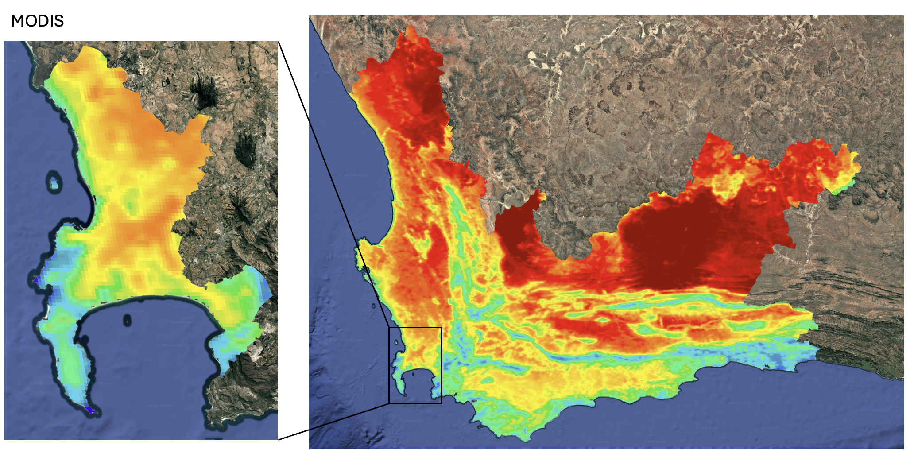
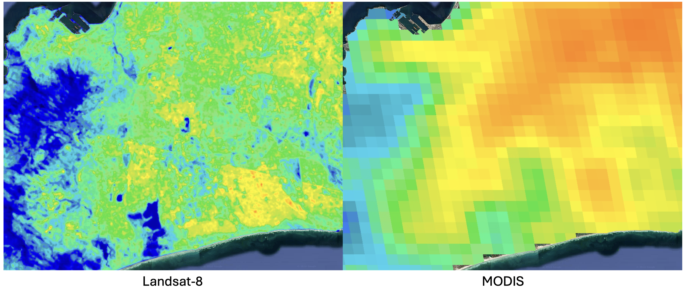
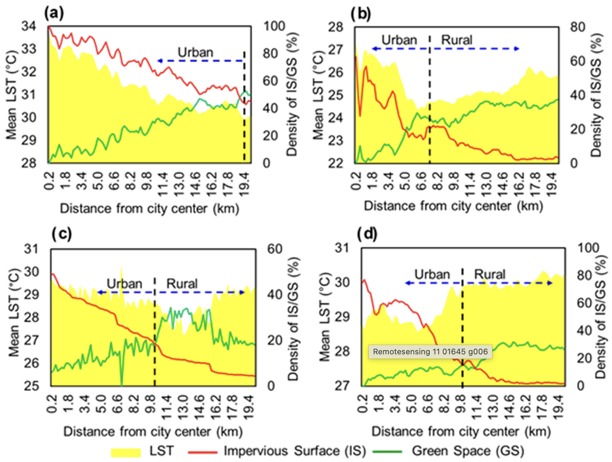

# Temperature {.unnumbered}

Temperature is becoming an increasingly hot topic (pun intended) in the face of a rapidly changing climate. This is true for urban areas, with more and more cities recognizing the Urban Heat Island (UHI) effect. Even the UN's New Urban Agenda (NUA), which acts as a framework through which cities can achieve SDGs, states: "we commit ourselves to ... reducing the ... urban heat island effects". In rural contexts, temperature plays an extremely important role in agriculture, droughts and wildfires. While in the ocean, Sea Surface Temperature (SST) is critical for understanding ocean currents and upwelling zones.

### MODIS vs Landsat-8

Remote sensors can provide incredibly valuable information about temperature, both temporally and spatially. Here, we explore openly-available Landsat 8 and MODIS data.

+-----------------------------------+----------------------------------------------------+----------------------------------------------------------------------------------------------------------+
|                                   | Landsat-8                                          | MODIS                                                                                                    |
+===================================+====================================================+==========================================================================================================+
| **Resolution**                    | 30 m (re-sampled from the native 100 m resolution) | 1 km                                                                                                     |
+-----------------------------------+----------------------------------------------------+----------------------------------------------------------------------------------------------------------+
| **Re-sampling period**            | Every 16 days                                      | Every 1-2 days                                                                                           |
+-----------------------------------+----------------------------------------------------+----------------------------------------------------------------------------------------------------------+
| **Number of images per sample**   | 1                                                  | 2                                                                                                        |
|                                   |                                                    |                                                                                                          |
|                                   |                                                    | -   **terra** - Captures imagery at around 10:30am local time. Usually used for land studies             |
|                                   |                                                    |                                                                                                          |
|                                   |                                                    | -   **aqua** - Captures imagery at around 1:30pm local time. Usually used for ocean & atmosphere studies |
+-----------------------------------+----------------------------------------------------+----------------------------------------------------------------------------------------------------------+
| **Best for (but not limited to)** | Identifying local-scale spatial patterns           | Monitoring regional/global-scale patterns across time                                                    |
+-----------------------------------+----------------------------------------------------+----------------------------------------------------------------------------------------------------------+

#### Western Cape LST

I loaded imagery from both sensors for the Western Cape Province, and Cape Town specifically, for the summer months (October to February) from 2022 to 2025. This gave us 160 images from Landsat, and 894 images from MODIS (453 from Aqua day and 441 from Terra day). The average LST for both regions is shown below:




If we zoom in even further, we can really see the the difference in resolution between the two satellites. In the Landsat-8 image, we can see little pockets of high heat (for example, a 100m long building has a much higher temperature) and can clearly see the lower temperatures from water bodies. Nowhere near as much detail is captured by MODIS.



### MODIS: Temporal Studies

Given its near daily re-sampling period, MODIS is extremely valuable for any kind of regional temporal studies. We used GEE to export a csv of daily LST data for summer 2024/2025 in both Cape Town and Johannesburg, and used R to clean the data and create an interactive time series:

```{r}
#| echo: false
#| message: false
#| warning: false
library(ggplot2)
library(plotly)
library(dplyr)
library(forcats)

# 1. Pre-process the data
cities_clean <- read.csv(here::here("temp_graph.csv")) %>%
  mutate(
    date = as.Date(date),
    adm2_code = as.factor(adm2_code),
    adm2_code = fct_recode(adm2_code, 
                           "Cape Town" = "77317", 
                           "Johannesburg" = "77364"),
    # Create a custom label for the hover tooltip
    # Rounding mean to 1 decimal place here
    hover_text = paste0("Date: ", date, "<br>",
                        "Temp: ", round(mean, 1), "°C")
  ) %>%
  filter(date >= as.Date("2024-10-01"))

# 2. Build the ggplot
# Added 'text = hover_text' to the aesthetic mapping
p <- ggplot(cities_clean, aes(x = date, 
                              y = mean, 
                              color = adm2_code, 
                              group = adm2_code,
                              text = hover_text)) +
  geom_line(alpha = 0.8) +
  geom_point(size = 1) +
  scale_x_date(date_labels = "%b %Y", date_breaks = "1 month") +
  theme_minimal() +
  theme(
    axis.text.x = element_text(angle = 45, hjust = 1),
    legend.position = "bottom"
  ) +
  labs(
    title = "Land Surface Temperature: Cape Town vs. Johannesburg",
    x = "Date",
    y = "Mean Land Surface Temperature (°C)",
    color = "City"
  )

# 3. Make it interactive and specify 'tooltip'
# This tells plotly to ONLY show the 'text' aesthetic we created
ggplotly(p, tooltip = "text")
```

## Applications

The efficacy of remote sensing for climatology and meteorology studies, especially at a global scale, is undeniable. However, I'm going to focus on more local-level applications, specifically to do with urban heat islands. @zhou2019 did a systematic literature review of satellite-based surface urban heat island (SUHI) studies from 1972 to 2018, and found that 78% of the 534 publications used Landsat (TM, ETM+, TIRS) or Terra/Aqua MODIS data. Again, this shows the value of free and open access data, although we still see a concentration of publications in the Global North, with only 5% (29) of the studies focusing on South America and Africa [@zhou2019].

![Geographic distribution of Surface Urban Heat Island publications (1971-2018) [@zhou2019]](images/clipboard-1375193372.png)

This geographic imbalance is particularly concerning because the few studies that *do* focus on these regions reveal unique dynamics.

@simwanda2019 investigated the influence of land cover data (percentage cover of impervious surfaces and green spaces extracted from spectral indices) on LST (derived from Landsat-8 OLI/TIRS) in Lagos (Nigeria), Nairobi (Kenya), Addis Ababa (Ethiopia) and Lusaka (Zambia). The results mirrored well-documented SUHI patterns [@yuan2007]: LST increases as teh percentage cover of impervious surfaces and green spaces increases. More importantly, they showed that, although most African cities have relatively larger green space to impervious surface ratios, the UHI effect is still evident, largely due to most of the green space being located outside the urban core.



Identifying the patterns unique to African cities is extremely important, but coming up with solutions for making the data more accurate for the local context is a crucial next step.

Standard satellite LST products (like Landsat and ECOSTRESS) sometimes report Surface Urban Cool Islands (SUCIs) - where cities appear cooler than rural areas - in major African cities such Kano, Khartoum, and Bamako @nichol2025. This conflicts with in-situ air temperature data, which indicate SUHIs. So what's causing this discrepancy? The short answer - the influence of emissivity. Emissivity is the efficiency with which a surface emits thermal radiation. Standard algorithms are less accurate for low-emissivity surfaces - like metal roofs which cover large portions of high-density residential areas in African cities. @nichol2025 found that, for a Landsat image, LST values for the urban area increased from 41 ◦C to 44, 46, and 49 ◦C when metallic surfaces were allocated emissivity values of 0.96, 0.83, 0.74, and 0.63

![ECOSTRESS images showing LST over the Kano urban area: (a) summer night, (b) summer day, and (c) ECOSTRESS emissivity band for (b). [@nichol2025]](images/clipboard-4149831458.png)

## Reflection

As someone who comes from a more environmental background, learning about the UHI effect and global temporal and spatial temperature patterns in undergrad and honours, I thoroughly enjoyed this section and getting a glimpse into how to collect some of the data that forms the foundation of this research. It's incredible to think how influential remote sensing has been to the body of literature on temperature, especially considering how much data is open access.

Skimming through the titles of the papers that @zhou2019 included in their literature review was honestly a bit overwhelming! Quite frankly, it seemed like there were so many papers from North America and Asia that did similar things and found similar results. I'm sure that a lot of the papers were quite different (and it was probably just because I read the titles only!), but the lack of representation of Africa, Central & South America and Oceania is quite staggering!

While the sheer number of publications in the review by @zhou2019 is impressive, the geographic distribution of these is less-so - with so few of the studies concentrated on Africa, South & Central America, and Oceania. Skimming the titles of the papers chosen in the review, it, quite frankly, seemed like there were so many papers from North America and Asia that did similar things and found similar results. Consequently, I think that much of the concepts and dynamics of urban heat are over-fitted to urban landscapes in North America and Asia.

It's reassuring to see studies investigating the unique local realities in African cities and proactively coming up with ways to reduce discrepancies in 'standard' methodologies. This is the kind of work I aspire to do in the future.
